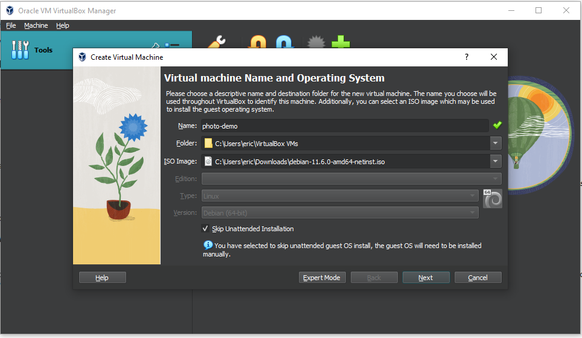
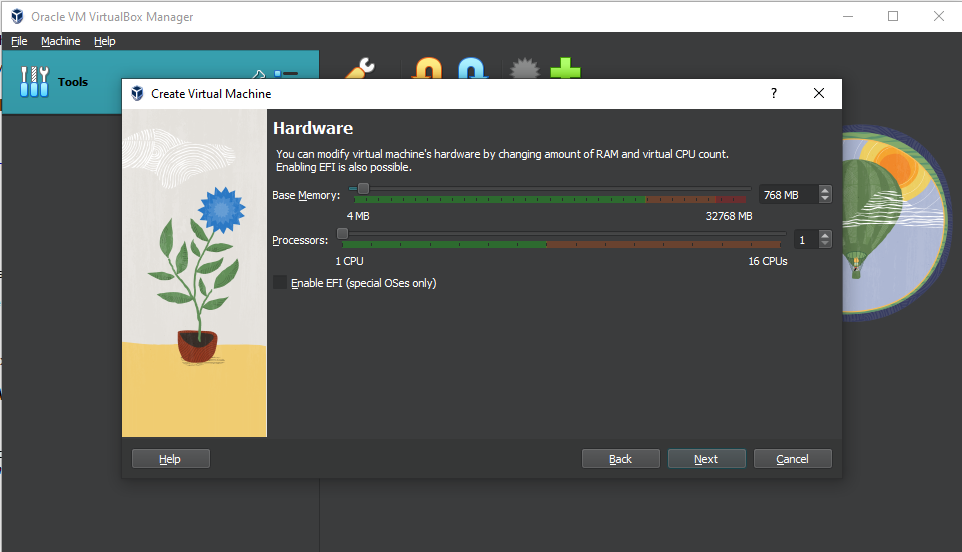
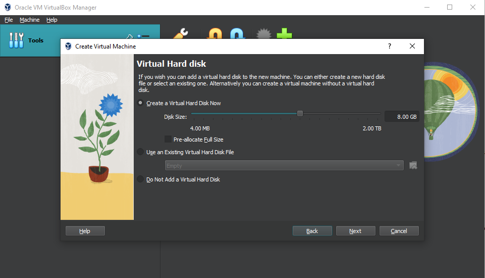
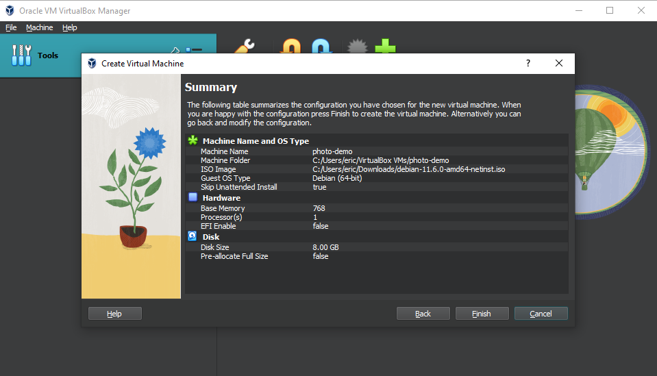
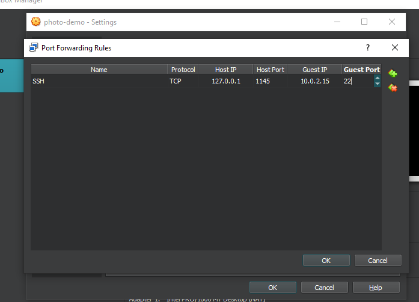
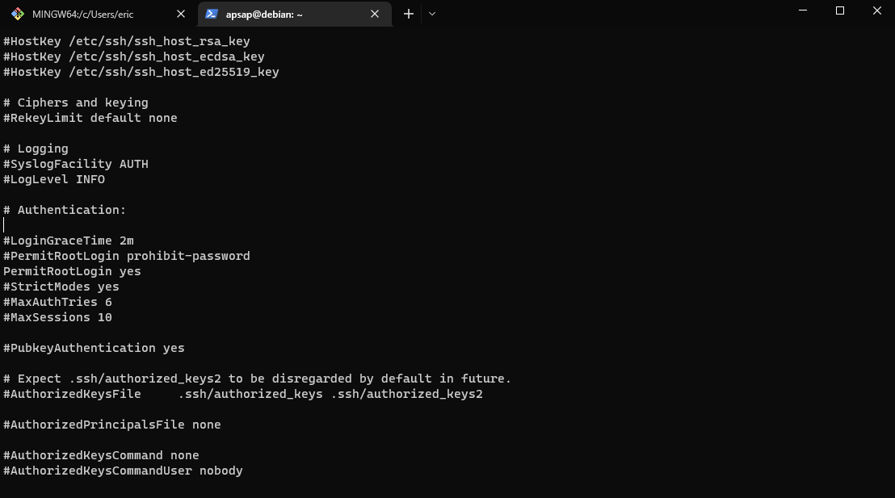
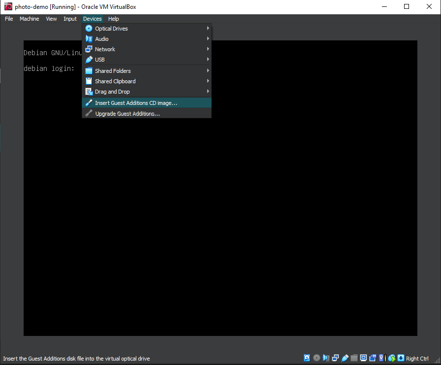
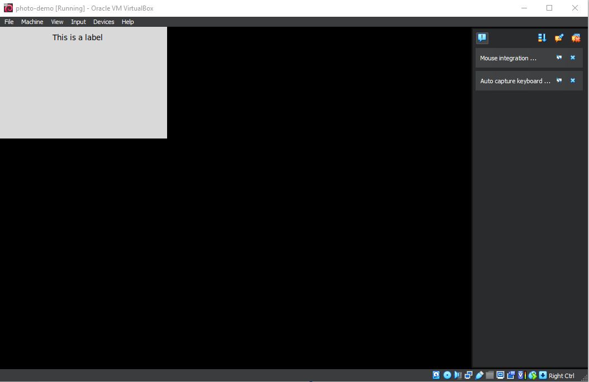
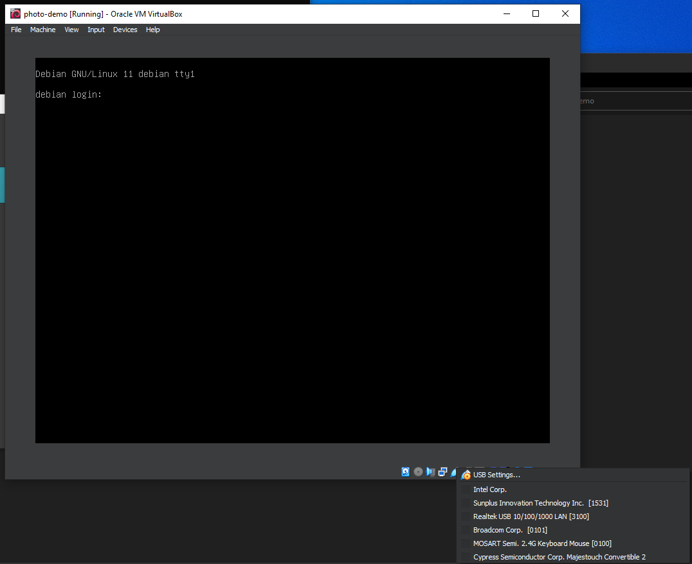

# Virtual Machine Setup

### Download [VirtualBox](https://www.virtualbox.org/wiki/Downloads) and [Debian image](https://www.debian.org/download)

### Setup VM
- Set OS type. __TICK 'SKIP UNATTENDED INSTALLATION'!!!__


- Set memory and CPU


- Set virtual hard disk


- Summary


- Enable port forwarding


### Install debian
- Graphical Install
- Location: Asia
- Location: Hong Kong
- Keyboard: US
- Network hardware: detect automatically
- Host name: debian
- Domain name: leave as empty
- Root password: `FuckCan0n!`
- repeat
- Full name of user: `APSAP`
- user name: `apsap`
- user password: can be same as root's password
- Disk partition: use default options. (use entire disk, all file in one portion)
- Scan extra media? No
- Mirror country: Hong Kong 
- Mirror station: `deb.debian.org`
- HTTP proxy: empty
- Participate in usage survey? No
- Software: SSH server and Standard System Utilities ONLY
- Install GRUB: yes, select `/dev/sda`
- Completed. Continue.

### Enable root ssh login
- Login as a common user (`apsap` here), and use `su` to get root privilege 
- Edit `/etc/ssh/sshd_config` add one line 
```bash
PermitRootLogin yes
```

- Restart SSH server
```bash
systemctl restart sshd
```

### Install tools and libraries
Login as root, and
```bash
apt install python3-pip python3-tk gphoto2
pip3 install gphoto2
apt install xorg
```

### Install virtualbox addition 
- Insert CD


- Mount and install
```bash
mkdir /mnt/cdrom
mount /dev/cdrom /mnt/cdrom
cd /mnt/cdrom
sh ./VBoxLinuxAdditions.run --rnox11 
```

- Reboot
```bash
reboot
```

### Configure GUI startup for `apsap` user
Login as `apsap`, assume `~/xtest.py` is our GUI application,
```python
# ~/xtest.py
# Just a example
import tkinter as tk
from tkinter.ttk import Label

root = tk.Tk()
root.geometry('300x200')
root.resizable(False, False)
root.title('Label Widget Demo')

# show a label
label = Label(root, text='This is a label')
label.pack(ipadx=10, ipady=10)

root.mainloop()
```

- Edit `~/.xinitrc`
```
python3 xtest.py
```

- Edit `~/.bashrc`, add one line at end to start x at login
```bash
startx
```

- Logout and login again. The GUI should run automatically.


- To kill the running python program from another terminal, run 
```bash
kill -9 `ps -aux| grep python3 | head -n 1 | sed 's/ \+/\t/g' | cut -f2`
```

### Configure camera connection
- Connect the camera to computer through USB
- (right) click the USB icon at bottom of VM window
- Click the canon... (the one that looks like camera's device name)



If reports `Error: VERR_SHARING_VIOLATION`, try to run the virtualbox as admin / root

